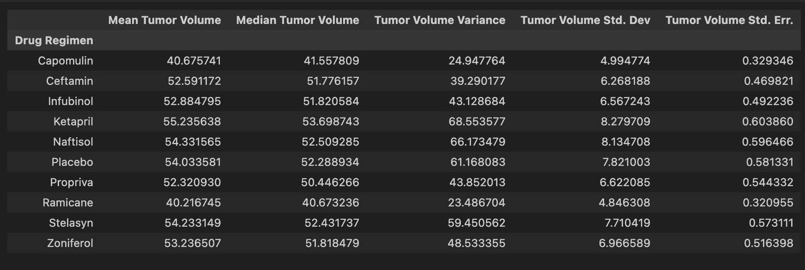
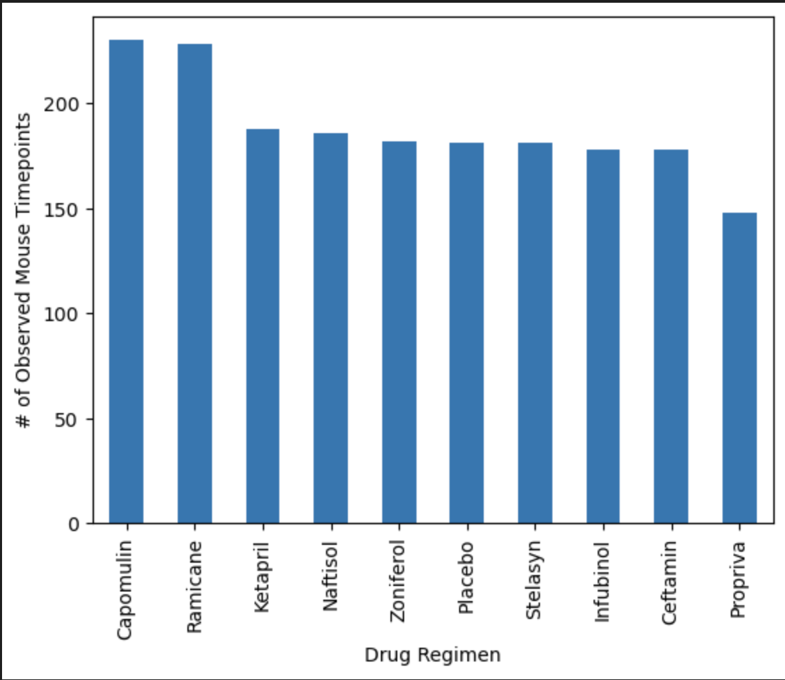
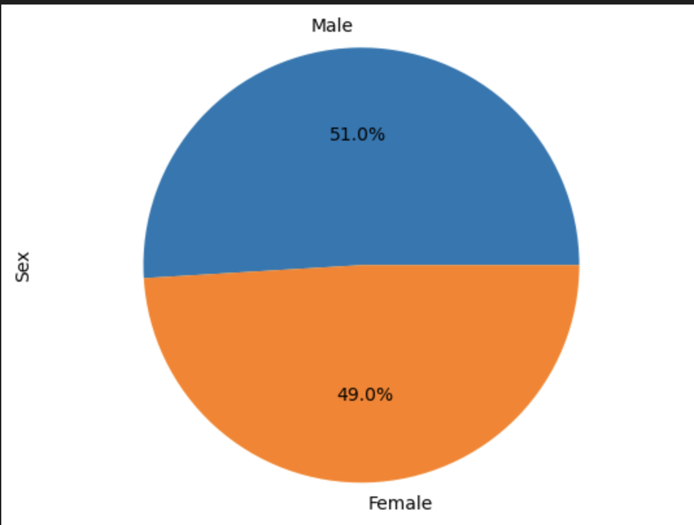
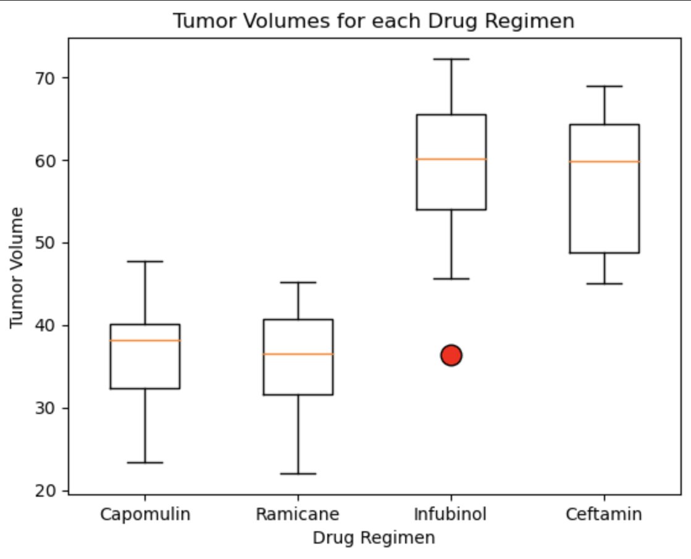
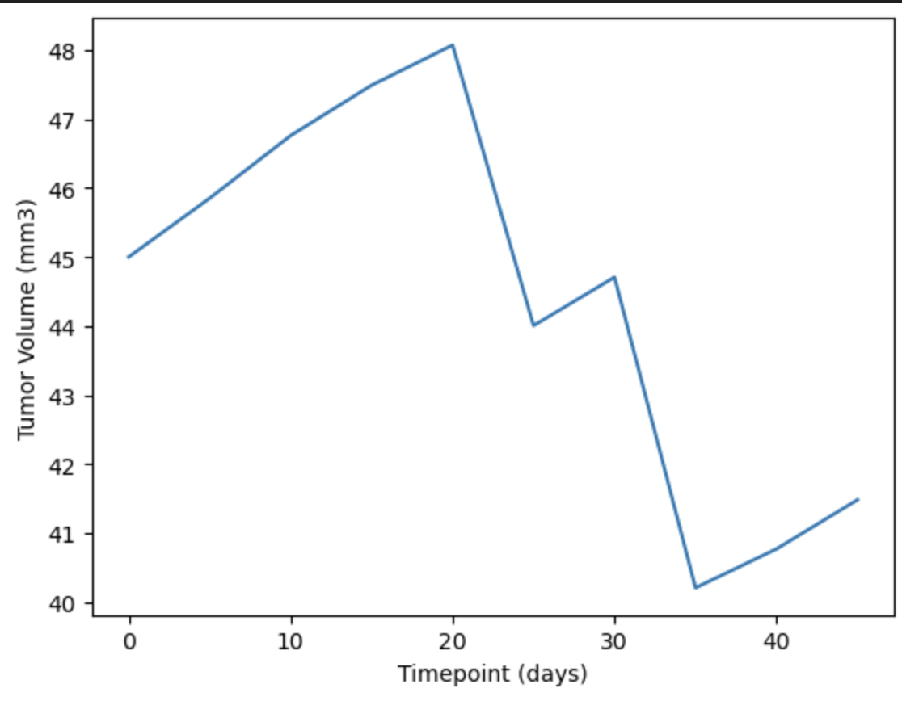
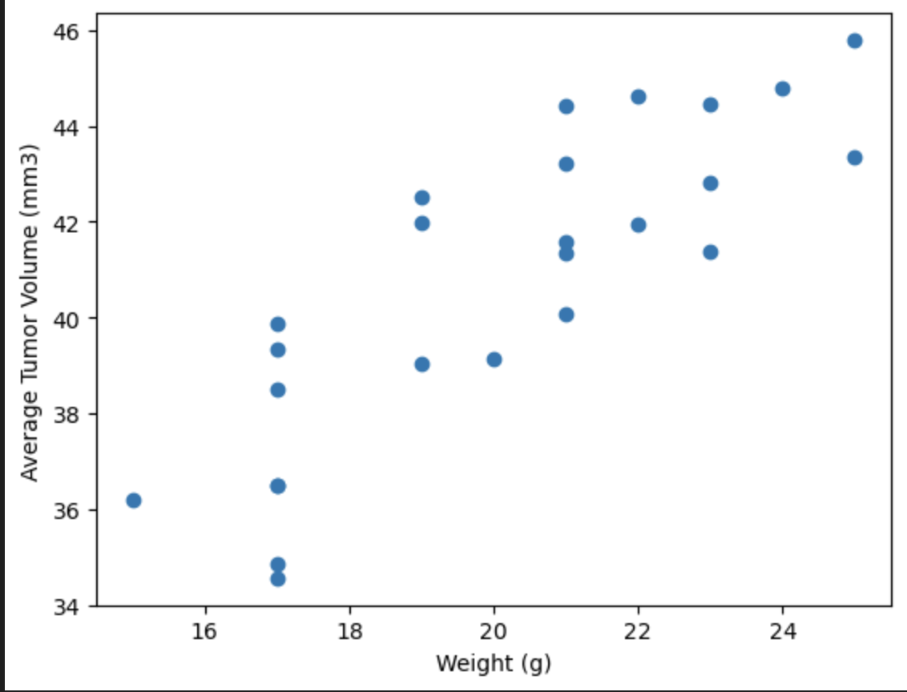
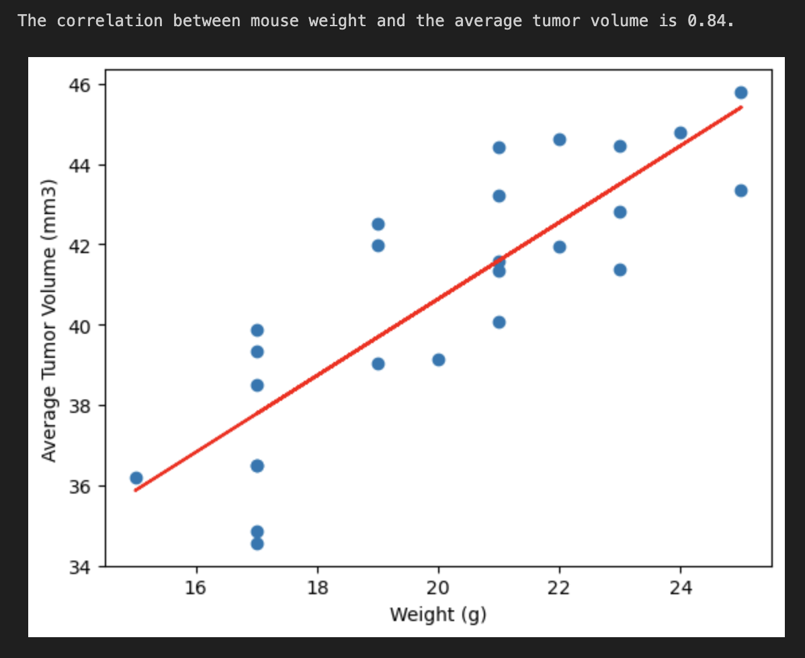
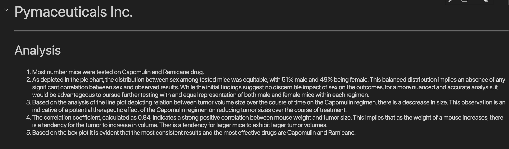

Source: https://www.google.com/search?q=funny+testing+lab+photos&sca_esv=598710583&tbm=isch&sxsrf=ACQVn09OfmOEv4AUyJMooSkXc8pOwImh5Q:1705382181236&source=lnms&sa=X&ved=2ahUKEwjjtPnYk-GDAxU4R2wGHebGAzAQ_AUoAXoECAEQAw&biw=1336&bih=881&dpr=1#imgrc=rTb0Xp5JNG_yTM

# Matplotlib-Challenge :chart_with_downwards_trend: :test_tube:
*In this assignment, I’ll create and manipulate Pandas :panda_face: DataFrames to analyse and visualise using Matplotlib 	:chart_with_upwards_trend: :bar_chart: outcomes of regimen testing on mice :mouse2:*
# Background
You've just joined Pymaceuticals, Inc., a new pharmaceutical company that specializes in anti-cancer medications. Recently, it began screening for potential treatments for squamous cell carcinoma (SCC), a commonly occurring form of skin cancer.

As a senior data analyst at the company, you've been given access to the complete data from their most recent animal study. In this study, 249 mice who were identified with SCC tumors received treatment with a range of drug regimens. Over the course of 45 days, tumor development was observed and measured. The purpose of this study was to compare the performance of Pymaceuticals’ drug of interest, Capomulin, against the other treatment regimens.

The executive team has tasked you with generating all of the tables and figures needed for the technical report of the clinical study. They have also asked you for a top-level summary of the study results.
#### Objectives
The purpose of this challenge is to create a script using Pandas and Jupyter Notebook, Matplotlib that analyses pharmaceutical records based on a dataset provided. This task is broken up into few steps:

##### Data Preparation and  Tasks
Perform the necessary calculations and then create a high-level summary statistics covering the following:

* Cleaning the data from duplicates to create a clean DataFrame for future reference
* Generate a summary statistic table calculating: the mean, median, variance, standard deviation, and SEM of the tumor volume for each regimen.

* Generate a Bar Plot using both Panda's DataFrame.plot() and Matplotlib's pyplot that calculates the relation between Timepoints and Drug Regimen.

* Generate a Pie Plot using both Panda's DataFrame.plot() and Matplotlib's pyplot that calculates the distribution of male vs. female mice in the test.

* Calculate the final tumor volume for four selected drug regimens: Capomulin, Ramicane, Infubinol and Ceftamin to determine potential outliers and calculate the quartiles and IQR.
Based on that information using Matplotlib, generate a box and whisker of the final tumor volume for all before mentioned treatments. 

* Select a mouse ID l509 that was treated with Capomulin and generate a line plot analysing relation between the timepoint and tumor volume for that specific mouse.

* Generate a scatter plot of mouse weight and average tumor volume for Capomulin treatment only.

* Calculate correlation coefficient and linear regression relating to mouse weight and the average tumor volume for Capomulin treatment. Plot the results with linear regression based on the previous scatter plot.

* Analyse the data.

#### Technologies used
* *Visual Studio Code - **Python** Software*
* *Excel* 
* *GitHub* 
* **Pandas**
* **Jupyter Notebook**
* **Matplotlib**

#### File list
* pymaceuticals_solved.ipynb
* Mouse_metadata.csv - resources file containing dataset
* Study_metadata.csv - resources file containing dataset
* Various Screen Shots
